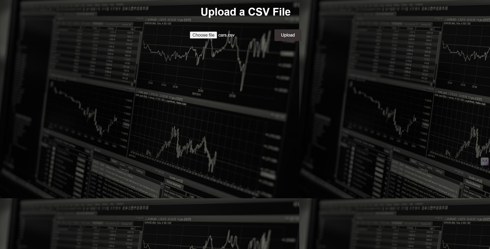
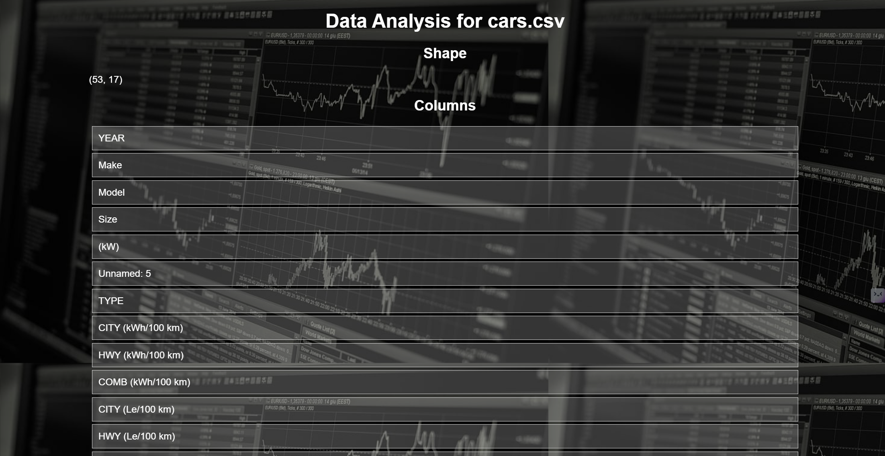
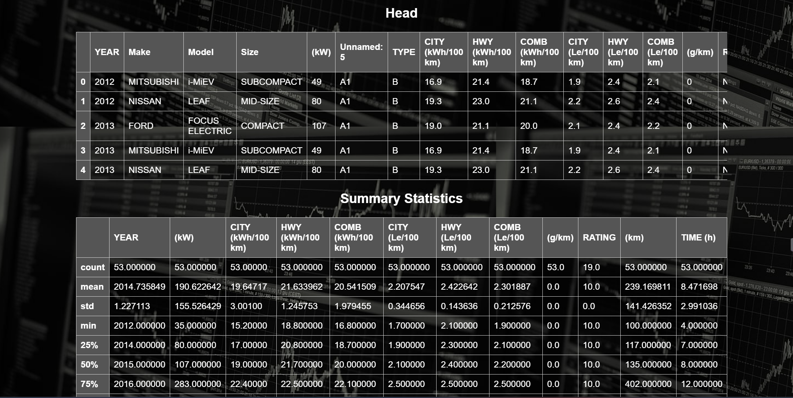

# Dataset-Analyser-
This project is a Dataset Analyser web application built using Flask that allows users to upload CSV files and performs basic data analysis on them. The analysis includes displaying the shape of the data, column names, the first few rows, summary statistics, missing values, and data types.

## Features

- Upload a CSV file
- Display the shape of the dataset
- List all column names
- Show the first five rows of the dataset
- Provide summary statistics
- Display the number of missing values in each column
- Show data types of each column

## Project Structure

```
.
├── app.py
├── templates
│   ├── analysis.html
│   └── upload.html
├── uploads
└── static
    └── img
        └── new.jpg
```

## Installation

1. Clone the repository:

```bash
git clone https://github.com/An1rud/Dataset-Analyser-.git
```

3. Install the required dependencies:

```bash
pip install -r requirements.txt
```

4. Create the `uploads` directory:

```bash
mkdir uploads
```

## Usage

1. Run the Flask app:

```bash
python app.py
```

2. Open your web browser and go to `http://127.0.0.1:5000/`.

3. Upload a CSV file using the provided form.

4. View the analysis of the uploaded CSV file.


## Outputs

### Upload Page



### Analysis Page



